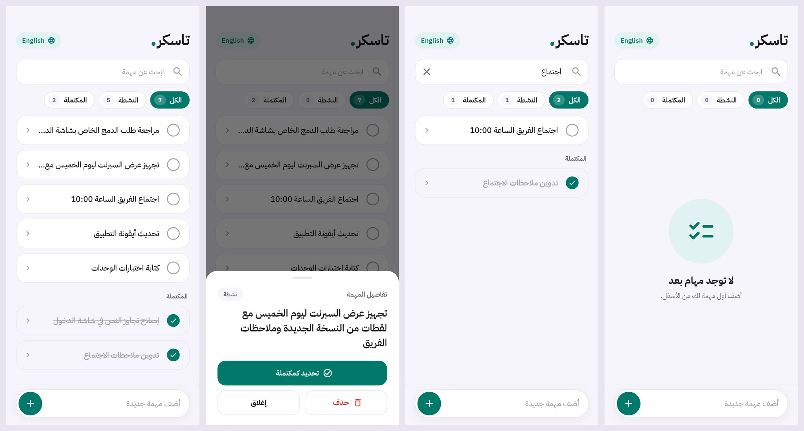
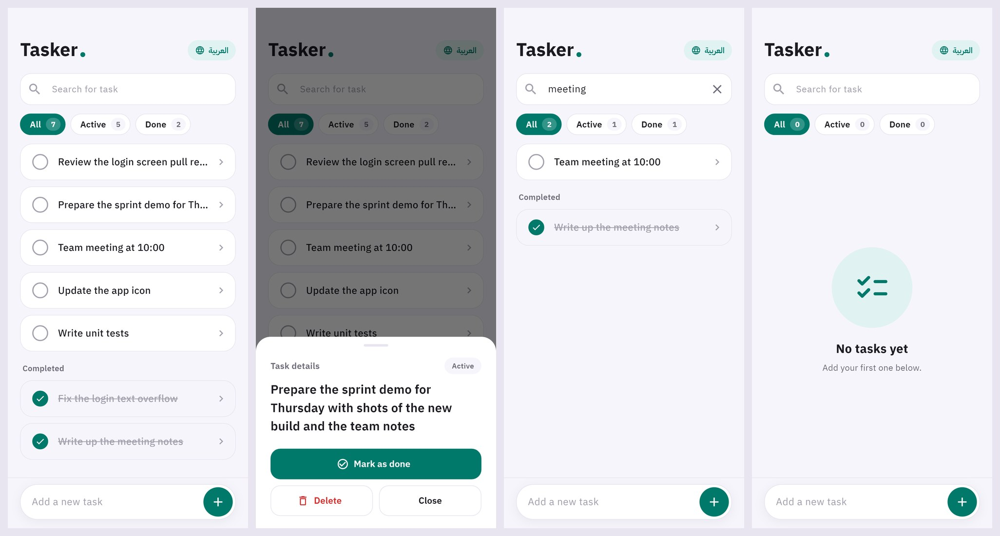

# Tasker — Task Scheduling App

A lightweight **Flutter** task manager with offline persistence.

## Features

- ✅ Create, complete, and delete tasks — swipe a task away, or open it for its full text and actions
- 🔎 Live search across your task list, with All / Active / Done filters and their counts
- 💾 Offline storage with **Hive** (code-generated type adapters)
- 🌍 **Arabic (RTL) and English** (`easy_localization`), switchable from the task list
- 🎨 Custom theming + splash screen

## Screenshots

| Arabic | English |
|---|---|
|  |  |

Rendered from the real screens with sample tasks by `tool/screens_golden_test.dart`.

## Stack

**Provider** for state management, **get_it** for service location, a dedicated `HiveService` and navigation service.

```
lib/
├── model/       # task model (+ generated Hive adapter)
├── provider/    # task state
├── screens/     # splash, task list
├── services/    # hive, navigation
├── themes/      # colours and theme
└── widget/      # todo item, search field, language switch
```

## Run it

```bash
flutter pub get
flutter run
```

## 📦 Packages

| Package | Version |
|---|---|
| `provider` | ^6.1.2 |
| `easy_localization` | ^3.0.8 |
| `get_it` | ^8.0.2 |
| `hive_flutter` | ^1.1.0 |
| `path_provider` | ^2.1.5 |
| `logger` | ^1.0.0 |
| `cupertino_icons` | ^1.0.8 |

